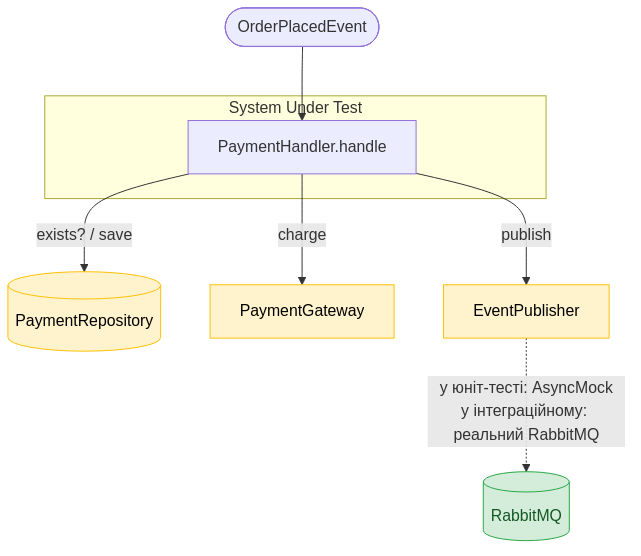
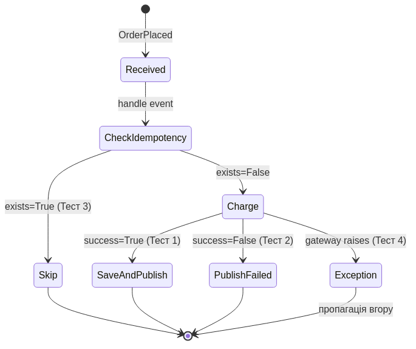
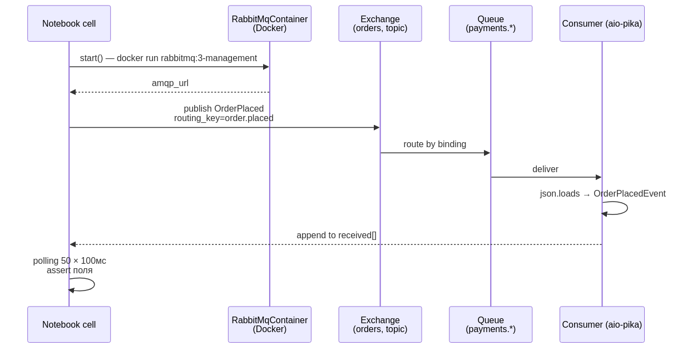
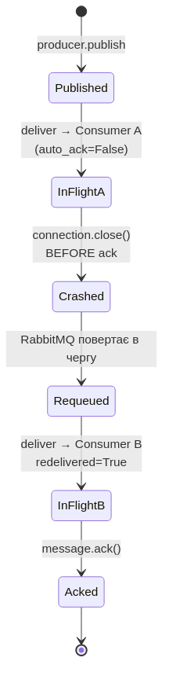

# Домашнє завдання 11 — Тестування Event-Driven Architecture

`pytest`-проєкт з трьома рівнями тестів `PaymentHandler`-а: юніт (`AsyncMock`), інтеграційні з реальним RabbitMQ через TestContainers, і chaos-сценарій із kill consumer до ACK.

## Передумови

Потрібен Python 3.10+ і Docker (будь-яка свіжа версія). Docker потрібен лише для інтеграційних і chaos-тестів — юніт-тести запускаються без нього.

## Встановлення

```bash
cd hw11
python3 -m venv .venv
source .venv/bin/activate
pip install -r requirements.txt
```

## Запуск тестів

| Команда | Що покривається |
|---|---|
| `python3 -m pytest test_unit.py -v` | 4 unit-тести `PaymentHandler` |
| `python3 -m pytest test_integration.py test_chaos.py -v` | 2 інтеграційні + 1 chaos (потребує Docker) |
| `python3 -m pytest -v` | усі 7 тестів |

> Перший запуск стартує RabbitMQ-контейнер (`rabbitmq:3.13-management`), наступні переіспользують той самий — session-scoped fixture.

---

## 1. System Under Test — `PaymentHandler`

`PaymentHandler` — серце сервісу платежів. Приймає `OrderPlacedEvent`, перевіряє ідемпотентність, викликає платіжний шлюз, публікує `PaymentProcessed` / `PaymentFailed`.



Жовтим — те, що ми мокаємо у юніт-тестах. Зеленим — реальний RabbitMQ, що піднімається через TestContainers у Частині 2 та бонусі.

Реалізація: [`payment_handler.py`](payment_handler.py).

---

## 2. Частина 1: Unit-тести (`AsyncMock` + AAA)

**Стратегія ізоляції:** мокаємо всі три залежності через `AsyncMock`. Перевіряємо side-effects:

| C# / NSubstitute | Python / AsyncMock |
|---|---|
| `mock.Received(1).Method(...)` | `mock.method.assert_awaited_once_with(...)` |
| `mock.DidNotReceive().Method(...)` | `mock.method.assert_not_awaited()` |
| `mock.Method(...).Returns(x)` | `mock.method.return_value = x` |
| `mock.Method(...).Throws(exc)` | `mock.method.side_effect = exc` |



### Підсумок

| # | Сценарій | `payment_exists` | `charge` | `save_payment` | `publish(Processed)` | `publish(Failed)` | Exception |
|---|---|:-:|:-:|:-:|:-:|:-:|:-:|
| 1 | Успіх | False | success=True | **1×** | **1×** | — | — |
| 2 | Невдача | False | success=False | — | — | **1×** | — |
| 3 | Дублікат | **True** | — | — | — | — | — |
| 4 | Шлюз падає | False | raises | — | — | — | **TimeoutError** |

Усе, що перевіряємо — **side-effects через моки**, бо хендлер не повертає значення (fire-and-forget). Це принципова відмінність від тестів моноліту.

Реалізація: [`test_unit.py`](test_unit.py).

---

## 3. Частина 2: Інтеграційний тест із TestContainers + RabbitMQ

**Чому реальний брокер?** Юніт-тести з моками **не побачать**:
- помилок serialization (`Decimal` → JSON → знову `Decimal`, datetime з timezone);
- неправильного routing key або binding (exchange→queue);
- проблем з ACK / re-delivery;
- неузгоджених локалей (`,` vs `.` як decimal-separator).



**Тест 1** — `test_publish_order_placed_consumer_deserializes`: декларуємо exchange + queue + binding, запускаємо consumer, publish-имо OrderPlaced із `Decimal("199.99")` (перевірка decimal-localization), polling 50 × 100мс до отримання, assert поля.

**Тест 2** — `test_republish_same_event_no_duplicates`: публікуємо ту саму подію (однаковий `event_id`) двічі; consumer тримає in-memory `set` оброблених `event_id` — друга delivery відкидається. Перевіряємо: `process_order.await_count == 1`.

> RabbitMQ не гарантує exactly-once delivery «з коробки» — це робить consumer-логіка через `event_id` як ідемпотентний ключ. У реальній системі — або БД-`UNIQUE`, або Redis-`SET NX`.

**Pitfalls:** потрібен Docker; перший старт контейнера ~10–20с — групуємо тести через session-scope fixture (`conftest.py::rabbit_container`).

Реалізація: [`test_integration.py`](test_integration.py).

---

## 4. Бонус: Chaos-тест — kill consumer до ACK → redelivery

**AMQP-семантика:**
- `auto_ack=False` (manual ACK) — RabbitMQ тримає повідомлення «in-flight», поки consumer не зробить `message.ack()`.
- Якщо channel/connection закривається **без ACK** — повідомлення повертається до черги з `redelivered=True`.



Сценарій (`test_consumer_crash_before_ack_triggers_redelivery`):

1. Publisher публікує `OrderPlacedEvent`.
2. Consumer A підхоплює повідомлення і робить `await asyncio.sleep(10)` перед `ack`.
3. Ми форсовано закриваємо connection A (`await consumer_a_conn.close()`) — еквівалент `docker kill`.
4. Consumer B підключається до тієї ж черги, отримує те саме повідомлення з `message.redelivered=True`.

Реалізація: [`test_chaos.py`](test_chaos.py).

---

## 5. Висновки

1. **Юніт-тести покривають всю гілкову логіку хендлера без брокера.** 4 тести × 4 гілки `PaymentHandler` ловлять регресію бізнес-логіки за мілісекунди, без Docker. Перевірка через `assert_awaited_once_with` / `assert_not_awaited` — Python-аналог `Received(1)` / `DidNotReceive()` з NSubstitute.

2. **TestContainers замінює моки на реальний RabbitMQ — єдиний рівень, що ловить bugs serialization, routing та ACK.** Юніт-тести з моками **ніколи** не побачать, що `Decimal` зник через `json.dumps`, або що routing key не збігається з binding. Pitfall — потрібен Docker; перший старт ~10–20с, тому групуємо тести через session-scope fixture.

3. **Chaos-тест на consumer crash — мінімальна страховка проти втрати повідомлень.** Реальні падіння в проді трапляються постійно (deploy, OOM, network blip). Якщо хендлер некоректно обробляє ACK — повідомлення або губляться, або множаться в DLQ. Перевіряємо `message.redelivered=True` після close-connection — це ~50 рядків коду, які рятують години розбору інцидентів.
